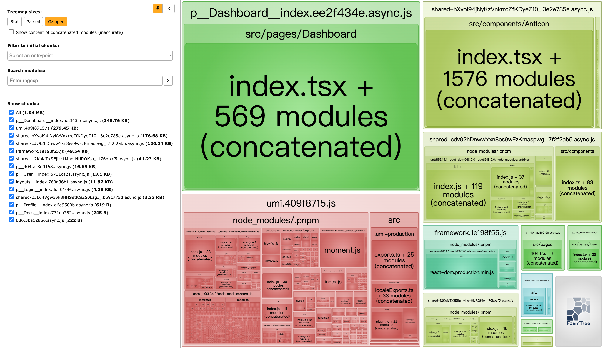

# react-umi-admin

正在制作中，敬请期待，点赞收藏不迷路，每天都会更新，直至完成第一版。然后会添加更多功能，但是更新频率会减慢，敬请期待。

基于 react18，umi4，antd5 等的中后台管理模版，可以快速开展我们的业务功能。

## 适用场景

1. 快速开发中后台管理系统，不必要为技术选型和封装模块而浪费精力和时间，而且不需要其他业务代码。
2. 当很多功能我们需要自己实现，所以这套项目只实现架构部分和用户登陆鉴权。市面功能太多的项目反而不利于我们快速开发。（ 通常我们需要研究很久，还要删除大部分内容。 而且前后端两套项目很难解耦。后面我会实现更多的功能包括配套的后台系统，不会放到这个项目下，会给传送门。）

## 功能清单

- [x] 支持多环境配置 [#33](https://github.com/GavinBirkhoff/react-umi-admin/issues/33)
- [ ] 自定义布局 Layout 和菜单
- [ ] 用户登录鉴权
- [x] 网络请求模块 基于 axios [#32](https://github.com/GavinBirkhoff/react-umi-admin/issues/32)
- [x] 系统异常处理
- [ ] 权限管理
- [x] UI 组件库 这里集成 antd5.x [#4](https://github.com/GavinBirkhoff/react-umi-admin/issues/4)
- [ ] 数据流
- [ ] 请求方案 [#6](https://github.com/GavinBirkhoff/react-umi-admin/issues/6)
- [x] 国际化(多语言) 在`~src/locales`支持国际化定义 [#7](https://github.com/GavinBirkhoff/react-umi-admin/issues/7)
- [x] Mock `~mock/` 里的文件都会自动加载 [#8](https://github.com/GavinBirkhoff/react-umi-admin/issues/8)
- [ ] 路由
- [ ] 路由 keepalive
- [ ] 路由数据加载
- [x] 编码规范以及 git 提交验证 [#12](https://github.com/GavinBirkhoff/react-umi-admin/issues/12)
- [x] 调试 [#13](https://github.com/GavinBirkhoff/react-umi-admin/issues/13)
- [ ] 测试
- [x] 环境变量 在`.env`中定义 [#15](https://github.com/GavinBirkhoff/react-umi-admin/issues/15)
- [ ] 代理
- [ ] 样式管理方案 [#17](https://github.com/GavinBirkhoff/react-umi-admin/issues/17)
- [x] Typescript 全面支持
- [ ] OpenApi
- [ ] 微生成器
- [ ] 开发插件
- [ ] MPA 模式
- [ ] 打包构建优化
- [ ] 生产环境部署
- [ ] 微前端
- [ ] 站点统计

## 开发环境

pnpm

node

vscode

## 弃用功能

- @umijs/max，黑盒比较严重，后期项目修改扩展成本太大。
- @ant-design/pro-components 的 ProLayout 太重了，一般情况都和设计效果有出路。

## 其他技术栈

- react-vite-admin 开发中
- next-admin 开发中
- nest-admin 后端 开发中
- java-admin 后端 开发中

## 后台数据

- 目前后台数据都在`~/mock`下，这里是基于 express 启动的本地 api 服务。
- 这样就可以很灵活的做好前端部分，然后灵活的对接一个后端服务。

## 启动项目

```bash
pnpm install

npm start
```

## 登陆页面

登陆路径：/login 登陆账号：admin 登陆密码：123456


## 首页

路径：/


## 用户页面

路径：/user


## 打包分析

```bash
npm run analyze
```


